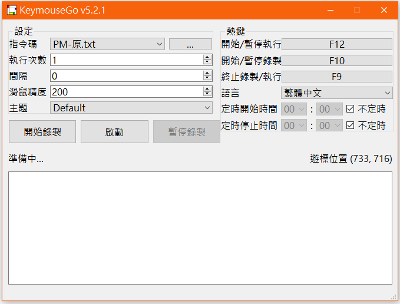

<div align="center">

# KeymouseGo

<br>


<div>
    
</div>
<div>
    
    
    
</div>
<div>
    <a href="https://deepwiki.com/taojy123/KeymouseGo">
        
    </a>
</div>
<br>

[繁體中文](README.md) | [English](README_en-US.md)

</div>

功能：記錄使用者的滑鼠鍵盤操作，通過觸發按鈕自動執行之前記錄的操作，可設定執行的次數，可以理解為 `精簡綠色版` 的 `按鍵精靈`。

用途：在進行某些操作簡單、單調重複的工作時，使用本軟體就可以很省力了。自己只要做一遍，然後接下來就讓電腦來做。


# 目錄

+ [安裝](#安裝)
+ [使用方法](#使用方法)
  + [基本操作](#基本操作)
  + [提示](#提示)
  + [指令碼語法說明](#指令碼語法說明)
+ [關於作者](#關於作者)
+ [開源貢獻者](#開源貢獻者)

# 安裝

該軟體通過 `Python` 語言編寫，已打包為可執行檔案，未安裝 `Python` 的使用者可直接下載 [release](https://github.com/taojy123/KeymouseGo/releases) 版本 ，直接點選 `KeymouseGo` 執行

### 原始碼打包可執行檔案

```
1. 安裝 Python3.10.11 (python-3.10.11-amd64.exe)

2. pip安裝依賴
- (Windows)            pip install -r requirements-windows.txt

3. pip安裝pyinstaller
- (Windows)            pip install pyinstaller

4. pyinstaller打包
- (Windows)            pyinstaller -F -w --add-data "./assets;assets" KeymouseGo.py


打包完成後，可執行exe檔案在專案路徑的`dist`資料夾內。

# 使用方法

## 基本操作

### 桌面模式

1、點選 `錄製` 按鈕，開始錄製。

2、在電腦上進行任意操作，如點選滑鼠、鍵盤輸入，這部分的動作會被記錄下來。

3、點選 `結束` 按鈕，結束錄製。

4、點選 `啟動` 按鈕，電腦會重複執行一遍第2步中所錄製的動作。

### 命令列模式

直接執行指定指令碼:
```
> ./KeymouseGo scripts/0314_1452.txt
```

執行指定指令碼3次:
```
> ./KeymouseGo scripts/0314_1452.txt -rt 3
> ./KeymouseGo scripts/0314_1452.txt --runtimes 3
```

## 提示

1、可設定指令碼重複執行的次數，如果為 `0` 即為無限循環。

2、預設啟動熱鍵為 `F12`，功能等同於 `啟動` 按鈕；預設終止熱鍵為 `F9`，按下後將會停止正在執行的指令碼。

3、錄製時只記錄滑鼠點選動作和鍵盤動作，不記錄滑鼠移動軌跡。

4、每次錄製結束后都會在 `scripts` 目前下產生一個新的指令碼檔案。

5、執行前可以在列表中選擇一個需要執行的指令碼。

6、`scripts` 下的指令碼檔案內容可以修改，修改時可參考如下所述 `指令碼格式說明`。

7、熱鍵設定中的`Middle`指代滑鼠中鍵，`XButton`指代滑鼠側鍵

8、由於程式速度受限，當輸入的滑鼠速度大於一定值時指令碼將無法以預期的輸入速度執行

9、部分系統環境中，可能出現無法錄製完整的滑鼠事件的情況，請以管理員身份/root身份執行此工具即可正常使用。

10、使用Mac的使用者，需要確保程式在輔助功能白名單，如果使用打包的exec檔案，則還需要確保終端也在輔助功能白名單。 如果app程式閃退，請嘗試給予`~/.qt_material`目錄下檔案的寫許可權:
```bash
chmod -R 770 ~/.qt_material
```

11、對於Linux/Mac使用者，如果在以系統管理員身分執行后仍然存在無法錄製或執行的問題，可以參考[pynput的文件](https://pynput.readthedocs.io/en/latest/limitations.html)

## 指令碼語法說明
> 演示螢幕解析度為`1920 * 1080`

指令碼為 `json5` 格式，每個最內層的jsonobject代表一個事件
```json5
{
  scripts: [
    // 開始執行 `3000ms` 后，在螢幕相對座標 `(0.05208, 0.1852)`即 `(100,200)` 處 `按下滑鼠右鍵`；
    {type: "event", event_type: "EM", delay: 3000, message: "mouse right down", action: ["0.05208%", "0.1852%"]},
    // 等待 `50ms` 后在相同位置 `抬起滑鼠右鍵`；
    // 橫縱座標為[-1, -1]時，表示在滑鼠目前所在位置執行操作。
    {type: "event", event_type: "EM", delay: 50, message: "mouse right up", action: [-1, -1]},
    // 等待 `1000ms` 后 `按下f鍵`；
    {type: "event", event_type: "EK", delay: 1000, message: "key down", action: [70, 'F', 0]},
    // 等待 `50ms` 后 `抬起f鍵`；
    {type: "event", event_type: "EK", delay: 50, message: "key up", action: [70, 'F', 0]},
    // 等待 `100ms` 后，在螢幕相對座標 `(0.2604, 0.4630)`即 `(500, 500)` 處 `按下滑鼠左鍵`；
    {type: "event", event_type: "EM", delay: 100, message: "mouse left down", action: ["0.2604%", "0.4630%"]},
    // 等待 `100ms` 后，滑鼠移動至相對座標 `(0.2604, 0.5556)`即 `(500, 600)` 位置；
    {type: "event", event_type: "EM", delay: 100, message: "mouse move", action: ["0.2604%", "0.5556%"]},
    // 等待 `100ms` 后，在螢幕相對座標 `(0.3125, 0.5556)`即 `(600, 600)` 處 `抬起滑鼠左鍵`；
    {type: "event", event_type: "EM", delay: 100, message: "mouse left up", action: ["0.3125%", "0.5556%"]},
    // 等待 `100ms` 后，在目前位置輸入 `你好 world` 文字。
    {type: "event", event_type: "EX", delay: 100, message: "input", action: "你好 world"}
  ]
}
```


## 高級功能

功能的使用詳見[wiki](https://github.com/taojy123/KeymouseGo/wiki/文件#指令碼語法)


# 關於作者

我是陶佳元，熱愛程式碼，懷舊，在網際網路上常用的 ID 有 taojy123 、tao.py。

我的個人站點 [tslow.cn](https://tslow.cn) 整理並羅列了一些 `個人專案` 和 `小工具` 合集。

你可以在 [簡書](http://jianshu.tslow.cn) 瀏覽我最新發布的文章，還可以在 [B站](https://space.bilibili.com/145137942) 觀看我的技術分享和生活紀實。

我的郵箱: taojy123@163.com

----------------------

# 開源貢獻者

[](https://github.com/taojy123/keymousego/graphs/contributors)

如果您是開發愛好者，並對本專案感興趣，歡迎參與專案的共同建設，您可以通過本專案的[**dev**](https://github.com/taojy123/KeymouseGo/tree/dev)分支檢視目前的進度，並且可以向本專案的[**dev**](https://github.com/taojy123/KeymouseGo/tree/dev)分支提交 Pull request 來貢獻程式碼。

註：如果您需要修改應用界面，請修改UIView.ui檔案並通過pyuic產生UIVIew.py,控制元件的初始化等操作請新增到UIFunc.py內。

感謝 JetBrains 免費提供開發工具

<a href="https://www.jetbrains.com/?from=KeymouseGo"></a>


# 關於差總2025年12月18日的最後修改

1. 修正原作者5.21最新版本(及最後的dev版本)均無法使用舊版txt腳本指令碼的嚴重錯誤
   (此問題發生的原因是因為, 作者把原來可以使用舊版3.22版格式的txt腳本指令碼的"message"全部改為"action_type, 這樣會導致舊txt無法使用!!!!)

2. 在作者github下載最新(dev)或release 5.21的源碼, 把資料夾裡面的全部"action_type"改回舊版必須兼容的"message", 可以解決txt無法使用的問題
   (notepad++ 多個檔案中搜尋action_type, 然後取代為message)
   (此問題研究很久, 下載多個版本源碼後發現)

3. 原作者繁體及簡體翻譯需要修補, 已完善

4. 移除音效及音量條(不會再發出聲音)

5. 移除原作者根據系統時區決定語言的程式碼, 改為由使用者自己選擇(繁體中文、English、簡體中文)

6. 界面所有文字由使用者選擇的語言決定而變化(原作者硬性規定簡體中文, 且游標硬性英文, 不合理)
